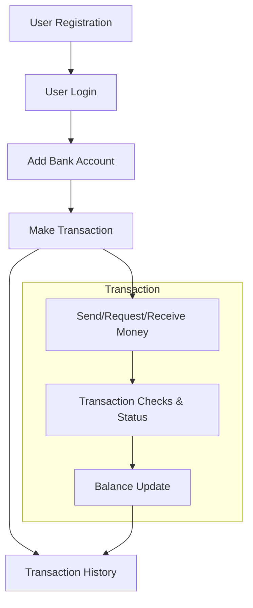

# 🚀 UPI App Backend

A production-ready backend for a UPI-based transaction system, built as a technical assignment for backend developers. This backend delivers robust, secure RESTful APIs for **user authentication**, **bank account management**, **UPI transactions**, and **transaction history**.

---

## 🛠️ Tech Stack

- **Node.js** (Express.js)
- **PostgreSQL**
- **JWT** (Authentication)
- **bcrypt** (Password Hashing)
- **Joi** (Validation)
- **uuid** (Unique IDs)

---

## ✨ Features

### 🗄️ 1. Database Schema
- **Normalized relational design**:  
  - `Users`
  - `Bank Accounts`
  - `Transactions`
- **Migrations & Seed Data**: Quick setup and test.
- **Performance**: Indexed tables for fast lookups.

### 🔒 2. Authentication & Authorization
- **JWT-based authentication**: Stateless, secure sessions.
- **Strong password security**: Hashed with bcrypt.
- **Role-based authorization**: API protection with middleware.

### 💸 3. UPI Transaction APIs
- **Send Money**: Instantly transfer funds via UPI ID.
- **Request/Receive Money**: Request or approve payments.
- **Transaction History**: Filter by date or status.
- **Check Balance**: See balances of all linked accounts.
- **Real-time Status**: Transactions marked as Pending, Success, or Failed.

### 🛡️ 4. Security & Validations
- **Input validation & sanitization**: All endpoints protected.
- **Rate limiting**: Prevents abuse on sensitive routes.
- **Sensitive data handling**: Secure storage of UPI IDs and passwords.

---

## ⚡ Quickstart

#### 1. **Clone & Install**

```bash
git clone "https://github.com/vikasyadavvvv/UPI-BACKEND-TASK.git"
cd UPI-BACKEND-TASK
npm install
cd src
nodemon index.js
```

#### 2. **Environment Setup**

Create a `.env` in the `src` folder:

```bash
PORT=4000
DATABASE_URL=your_postgres_connection_string
JWT_SECRET=your_secret
JWT_EXPIRES_IN=1h
SALT_ROUNDS=10
```

#### 3. **Database Setup**

- Ensure **PostgreSQL** is running.
- Run migrations and seeders (if provided).
- Paste the queries inside the PostgreSQL database in query tool and execute
  
```sql
BEGIN;

-- Users table
CREATE TABLE IF NOT EXISTS users (
id UUID PRIMARY KEY,
full_name TEXT NOT NULL,
email TEXT UNIQUE NOT NULL,
mobile TEXT UNIQUE NOT NULL,
upi_id TEXT UNIQUE NOT NULL,
password_hash TEXT NOT NULL,
created_at TIMESTAMP WITH TIME ZONE DEFAULT now()
);


-- Bank accounts
CREATE TABLE IF NOT EXISTS bank_accounts (
id UUID PRIMARY KEY,
user_id UUID NOT NULL REFERENCES users(id) ON DELETE CASCADE,
bank_name TEXT NOT NULL,
account_number TEXT NOT NULL,
ifsc TEXT NOT NULL,
balance NUMERIC(14,2) DEFAULT 0,
created_at TIMESTAMP WITH TIME ZONE DEFAULT now()
);


-- Transactions
CREATE TABLE IF NOT EXISTS transactions (
id UUID PRIMARY KEY,
from_account_id UUID REFERENCES bank_accounts(id),
to_account_id UUID REFERENCES bank_accounts(id),
amount NUMERIC(14,2) NOT NULL CHECK (amount > 0),
status TEXT NOT NULL CHECK (status IN ('PENDING','SUCCESS','FAILED')),
type TEXT NOT NULL CHECK (type IN ('SEND','REQUEST','RECEIVE')),
note TEXT,
created_at TIMESTAMP WITH TIME ZONE DEFAULT now()
);


-- Indexes to speed frequent queries
CREATE INDEX IF NOT EXISTS idx_users_upi_id ON users(upi_id);
CREATE INDEX IF NOT EXISTS idx_bank_user_id ON bank_accounts(user_id);
CREATE INDEX IF NOT EXISTS idx_transactions_from ON transactions(from_account_id);
CREATE INDEX IF NOT EXISTS idx_transactions_to ON transactions(to_account_id);
CREATE INDEX IF NOT EXISTS idx_transactions_created_at ON transactions(created_at);


COMMIT;
```

---

## 🔁 Backend Flow Overview



---

## 🧪 API Usage & Examples

### 1️⃣ Register User

- **POST** `/api/auth/register`
- **Body:**
```json
{
  "full_name": "Vikas Yadav",
  "email": "vikas@example.com",
  "mobile": "9876543210",
  "upi_id": "vikas@upi",
  "password": "123456"
}
```

### 2️⃣ Login

- **POST** `/api/auth/login`
- **Body:**
```json
{
  "email": "vikas@example.com",
  "password": "123456"
}
```
- **Response:** `{ "token": "<JWT_TOKEN>" }`
- Add header: `Authorization: Bearer <JWT_TOKEN>`

### 3️⃣ Add Bank Account

- **POST** `/api/backacc/add`
- **Header:** `Authorization: Bearer <JWT_TOKEN>`
- **Body:**
```json
{
  "bank_name": "BOB Bank",
  "account_number": "908290825390",
  "ifsc": "BOB0001234"
}
```

### 4️⃣ Send Money

- **POST** `/api/transactions/send`
- **Header:** `Authorization: Bearer <JWT_TOKEN>`
- **Body:**
```json
{
  "to_upi": "friend@upi",
  "amount": 1000,
  "note": "Payment"
}
```

### 5️⃣ Request Payment

- **POST** `/api/transactions/request`
- **Header:** `Authorization: Bearer <JWT_TOKEN>`
- **Body:**
```json
{
  "from_upi": "friend@upi",
  "amount": 500,
  "note": "Dinner share"
}
```

### 6️⃣ Respond to Payment Request

- **POST** `/api/transactions/respond/<request_id>`
- **Header:** `Authorization: Bearer <JWT_TOKEN>`
- **Body:**  
  `{ "action": "ACCEPT" }`  or  `{ "action": "REJECT" }`

### 7️⃣ Transaction History, Balance, Status

- **GET** `/api/transactions/history`
- **GET** `/api/transactions/balance`
- **GET** `/api/transactions/status/<txId>`

---

## 📑 Postman Collection

- Import these endpoints into Postman.
- Set `Authorization` header after login for all protected APIs.

---

## 📁 Project Structure


---

## 🏆 Best Practices

- **Clean, modular codebase**: Separation of controllers, services, middlewares.
- **Production-grade error handling** & **input validation**.
- **Secure storage** of credentials and sensitive data.
- **RESTful API conventions**.

---

## 🧑‍💻 Author

**[Vikas Yadav](https://github.com/vikasyadavvvv)**

---
